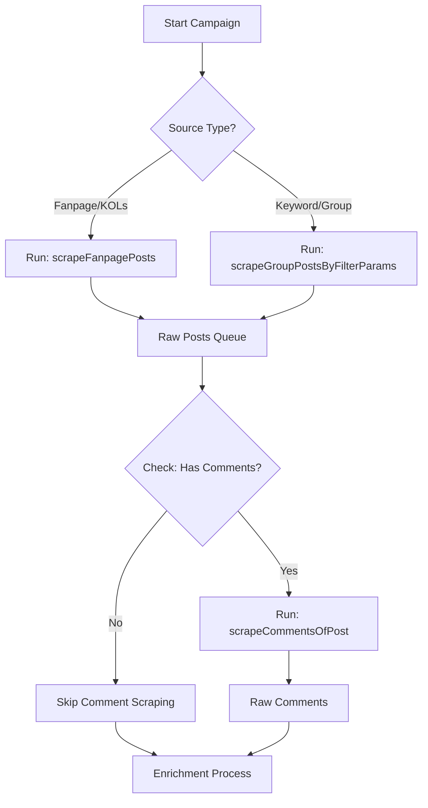

Chào bro, tôi đã "mổ xẻ" cái report **ZaloPay - Tết Nguyên Nhà** này rồi.

Report này không chỉ đơn thuần là đếm số lượng bài viết. Nó tập trung vào **Insight (Sự thấu hiểu)**: Sắc thái cảm xúc (Sentiment), Chủ đề thảo luận (Topic), và Nguồn thảo luận (Source Breakdown).

Với 3 hàm bro đang có (`Fanpage`, `GroupSearch`, `Comments`), bro đã có đủ "tay chân" để đi lấy nguyên liệu. Bây giờ bro cần một "bộ não" (Workflow) để lắp ghép chúng lại thành Data Model chuẩn.

Dưới đây là **Luồng nghiệp vụ (Business Workflow)** và **Data Model** tối ưu để xuất ra được report này.

---

### 1. Phân Tích Report: Chúng ta cần Data gì?

Từ report PDF, tôi bóc tách ra các metrics cốt lõi cần phải tính:

1. **Buzz Volume:** Tổng lượng thảo luận = (Số bài Post + Số Comment + Số Share).
2. **Sentiment Score:** Tỷ lệ Tiêu cực (Negative) / Tích cực (Positive). *-> Cần phân tích text.*
3. **Campaign Topics:** Người dùng nói về cái gì? (Nhạc Tết, Game Lắc Xì, VinFast, Từ thiện CSR). *-> Cần gán nhãn (Tagging).*
4. **Source Contribution:** Thảo luận đến từ đâu? (Brand Page, KOLs, hay Community Group).

---

### 2. Thiết Kế Luồng Nghiệp Vụ (The Workflow)

Bro không nên chạy tuần tự (Sequential) vì sẽ rất chậm. Hãy thiết kế theo mô hình **Pipeline**.

#### Giai đoạn 1: Configuration (Thiết lập chiến dịch)

Trước khi chạy code, bro cần định nghĩa Input:

* **Owned Media (Brand):** URL Fanpage ZaloPay -> Dùng `scrapeFanpagePosts`.
* **Paid Media (KOLs):** List URL Fanpage KOLs (Lê Dương Bảo Lâm, Trang Pháp...) -> Dùng `scrapeFanpagePosts`.
* **Earned Media (Community):** List Keywords ("ZaloPay", "Lắc Xì", "Tết Nguyên Nhà") -> Dùng `scrapeGroupPostsByFilterParams`.

#### Giai đoạn 2: The Scraping Engine (Vận hành 3 hàm của bro)



#### Giai đoạn 3: Enrichment (Làm giàu dữ liệu - Bước quan trọng nhất)

Sau khi hàm của bro trả về Raw Text, bro cần một bước xử lý đi qua các bộ lọc:

1. **Filter Spam:** Loại bỏ bài bán sim, xổ số.
2. **Auto-Tagging:** Nếu content chứa "VinFast" -> Tag `topic: "VINFAST"`.
3. **Sentiment Analysis:** Chấm điểm bài viết (Tạm thời bro có thể dùng từ điển keyword: "lỗi", "lag" -> Negative).

---

### 3. Data Model (TypeScript Interfaces)

Đây là đích đến cuối cùng. Bro cần lưu dữ liệu theo cấu trúc này để query ra report.

#### A. Bảng `SocialMention` (Dùng chung cho cả Post và Comment)

Tôi gộp Post và Comment vào một model chung (vì bản chất chúng đều là một đơn vị thảo luận - Mention) để dễ tính toán Buzz Volume.

```typescript
export enum MentionType {
  POST = 'POST',
  COMMENT = 'COMMENT'
}

export enum ChannelType {
  OWNED = 'OWNED',   // Fanpage ZaloPay
  PAID = 'PAID',     // KOLs
  EARNED = 'EARNED'  // Group/User
}

export enum SentimentType {
  POSITIVE = 'POSITIVE',
  NEUTRAL = 'NEUTRAL',
  NEGATIVE = 'NEGATIVE'
}

export interface SocialMention {
  // 1. Identity
  id: string;              // ID bài viết/comment
  parentId?: string;       // Nếu là Comment thì đây là ID bài Post gốc
  url: string;             
  type: MentionType;       // Post hay Comment?

  // 2. Content & Metrics (Từ hàm scrape của bro)
  content: string;
  publishedAt: Date;
  author: {
    id: string;
    name: string;
    isVerified: boolean;   // Lấy từ hàm check tích xanh (Quan trọng để lọc KOL)
  };
  stats: {
    likes: number;
    comments: number;
    shares: number;        // Chỉ Post mới có
    views?: number;        // Nếu cào được video
  };

  // 3. Metadata chiến dịch (Cực quan trọng cho Report)
  // Các trường này bro phải xử lý SAU khi cào xong
  enrichment: {
    channel: ChannelType;  // Phân loại nguồn (Brand/KOL/Group)
    sentiment: SentimentType; 
    keywords_matched: string[]; // Keyword nào đã trigger bài này?
    is_spam: boolean;
  };
}

```

#### B. Bảng `CampaignConfig` (Cấu hình)

Để controller biết cần gọi hàm nào.

```typescript
export interface CampaignConfig {
  id: string;
  name: string; // "Tết Nguyên Nhà"
  duration: {
    start: Date; // 01 Nov 2024
    end: Date;   // 15 Feb 2025
  };
  targets: {
    fanpages: string[]; // List URL để chạy scrapeFanpagePosts
    keywords: string[]; // List Key để chạy scrapeGroupPostsByFilterParams
    topics_definition: { // Định nghĩa topic để auto-tag
      code: string;      // "VINFAST"
      keywords: string[];// ["vinfast", "xe điện", "trúng xe"]
    }[];
  };
}

```

---

### 4. Mapping từ Hàm Scrape sang Report

Để ra được các biểu đồ trong PDF, bro thực hiện query như sau:

#### Chart 1: Diễn biến thảo luận (Timeline)

* **Logic:** Query `SocialMention` where `is_spam = false`.
* **Group by:** `publishedAt` (theo ngày/tuần).
* **Metric:** Count(id).

#### Chart 2: Sắc thái thảo luận (Sentiment Pie Chart)

* **Input:** Hàm `scrapeCommentsOfPost` là quan trọng nhất ở đây. Vì bài Post thường Neutral, nhưng Comment mới chứa Negative/Positive.
* **Logic:**
* Lấy toàn bộ Comment của các bài Post hot.
* Phân loại Sentiment.
* Tính % Negative trên tổng số.


#### Chart 3: Top Sources (Nguồn thảo luận)

* **Logic:**
* `scrapeFanpagePosts` (ZaloPay) -> Gán `channel = OWNED`.
* `scrapeFanpagePosts` (KOLs) -> Gán `channel = PAID`.
* `scrapeGroupPostsByFilterParams` -> Gán `channel = EARNED`.


* **Report:** So sánh Buzz Volume của 3 channel này.

#### Chart 4: Cloud Topic (Chủ đề nổi bật)

* **Logic:** Duyệt qua field `enrichment.topics`.
* **Ví dụ:**
* Post có chữ "Lắc Xì" -> Tag `GAME`.
* Comment "Nhạc hay quá" -> Tag `MUSIC`.


* **Report:** Đếm số lượng mention của từng Topic Tag.

### Tổng kết

Bro đã có 3 công cụ (Hàm scrape) rất mạnh. Việc cần làm bây giờ là:

1. **Dựng Database** theo model trên.
2. Viết một **Orchestrator (Service điều phối)** để gọi 3 hàm này và map dữ liệu vào model `SocialMention`.
3. Viết thêm module nhỏ **Auto-Tagging** (đơn giản là if/else keyword match) để điền dữ liệu vào `enrichment.topics`.

Là bro sẽ có ngay cái report xịn sò như Buzzmetrics!
